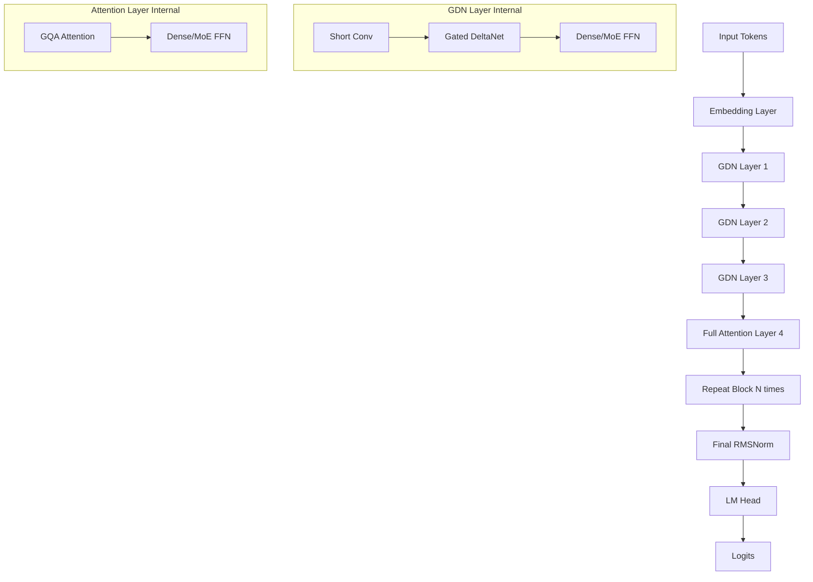

# Architecture Design: Hybrid Linear-Attention Transformer (Qwen 3.5 Style)

Based on the existing codebase, I propose a highly efficient and scalable architecture that leverages the hybrid strengths of Gated DeltaNet (GDN) and standard Attention.

## 1. Core Architecture Strategy
The design follows a **Hybrid Decoder-Only** pattern. The goal is to maximize throughput and context length using linear attention while maintaining the high reasoning/retrieval quality of standard softmax attention.

### Layer Composition
We will use a repeating block structure (e.g., a "Hybrid Block" of 4 layers):
- **Layers 1, 2, 3**: Gated DeltaNet (GDN) Layers
- **Layer 4**: Full Softmax Attention Layer

### Component Details
| Component | Implementation Detail |
| :--- | :--- |
| **Normalization** | [RMSNorm](qwen35/norms.py:6) (Pre-normalization) |
| **Positional Embedding** | [RoPE](qwen35/rope.py:5) (Rotary Positional Embeddings) |
| **Linear Attention** | [Gated DeltaNet](qwen35/gdn.py:204) with Delta Rule recurrence |
| **Full Attention** | [Grouped Query Attention (GQA)](qwen35/attention.py:11) |
| **Activation** | SwiGLU |
| **FFN Strategy** | Hybrid: Dense SwiGLU for standard layers, optional [MoE](qwen35/mlp.py:19) for capacity |

---

## 2. System Workflow (Mermaid)

---

## 3. Implementation Roadmap

### Phase 1: Configuration & Foundation
- Define a unified [Qwen35Config](qwen35/config.py:18) to toggle MoE, hybrid intervals, and head dimensions.
- Ensure [ModelCache](qwen35/cache.py:9) is unified to handle both KV states and GDN recurrent states.

### Phase 2: Hybrid Block Integration
- Implement a `build_decoder_layer` factory that dynamically assigns `GDNLayer` or `AttentionLayer` based on the layer index.
- Use `repeat_interleave` for GQA to optimize memory.

### Phase 3: Efficiency Optimizations
- Use **Chunked GDN** for parallel training.
- Use **Recurrent GDN** for O(1) inference.
- Enable **Gradient Checkpointing** at the layer level.

## 4. Key Design Decisions
1. **GQA (Grouped Query Attention)**: Use a `num_key_value_heads` < `num_attention_heads` (e.g., ratio of 4 or 8) to reduce cache size.
2. **Shared Experts in MoE**: Always route to 1 shared expert and top-k (e.g., 2) routed experts to maintain a base level of knowledge across all tokens.
3. **Short Convolutions**: Keep a small kernel (k=4) to give the linear attention a local "look-back" window before the global linear accumulation.

---
**Would you like me to refine any specific part of this design, such as the MoE routing logic or the GDN chunking parameters?**
